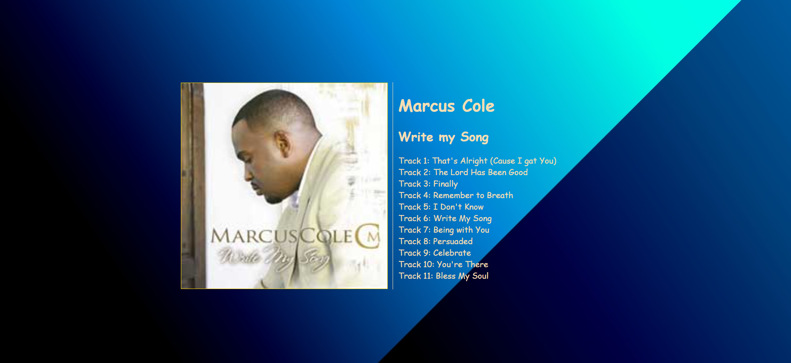

# complete-album-page-with-js-alone

## Desciption

creating and album page complete in javascript without html or css natives

## software

javascript, vscode

## methodology

    ** nested array inside object
    ** dom manipulation and querry
    ** web API
    ** ES6 variables

## links to application

    ** Github:          https://github.com/ollyvent/complete-album-page-with-js-alone
    ** deployed site:   https://ollyvent.github.io/complete-album-page-with-js-alone/

## image from live-server    
    
    assets/images/liveserver_preview.png
